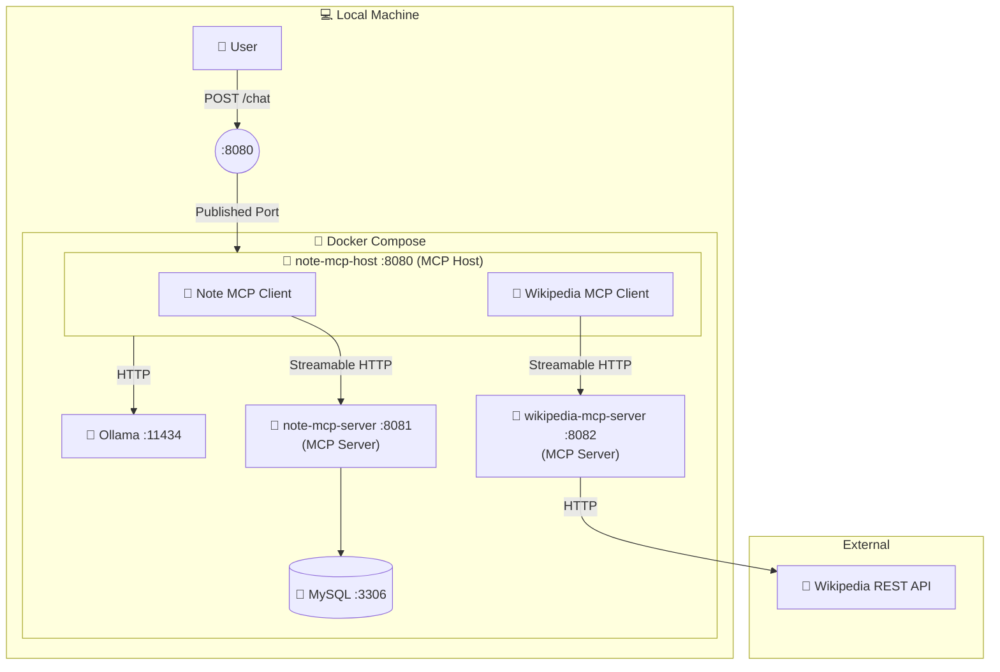

# Spring AI MCP Example

A sample project for learning MCP (Model Context Protocol) with Spring AI. The LLM invokes tools on MCP servers to manage notes and search Wikipedia.

## Architecture



## Tech Stack

| Technology | Version |
|---|---|
| Java | 25 |
| Spring Boot | 4.0.3 |
| Spring AI | 2.0.0-M2 |
| Ollama (qwen3:4b) | latest |
| MySQL | 9 |

## Components

### note-mcp-host (MCP Host with MCP Clients)

The host application sits between the user and the LLM. It receives chat messages from the user and sends them to Ollama via Spring AI's `ChatClient`. The LLM decides when to invoke MCP tools as needed.

- `POST /chat` — Accepts a natural language message and returns the AI response
- `GET /notes/{id}/summary` — Retrieves a summarization prompt from the MCP server and returns the LLM's summary

### note-mcp-server (MCP Server)

Exposes note CRUD operations as MCP tools and prompt templates as MCP prompts.

| Tool | Description |
|---|---|
| `create-note` | Create a new note (title, content, tags) |
| `list-notes` | List all notes |
| `get-note` | Fetch a note by ID |
| `update-note` | Update a note by ID |
| `delete-note` | Delete a note by ID |

| Prompt | Description |
|---|---|
| `summarize-note` | Summarize a note by its ID |

### wikipedia-mcp-server (MCP Server)

Exposes Wikipedia search and page retrieval as MCP tools.

| Tool | Description |
|---|---|
| `search-pages` | Search Wikipedia pages (query, limit) |
| `get-page-source` | Get the content of a Wikipedia page (title) |

## Quick Start

### Prerequisites

- Docker / Docker Compose
- NVIDIA GPU + nvidia-container-toolkit (recommended for Ollama GPU inference)

> **Note:** This project works without a GPU, but inference will be significantly slower.
> Reference times for a single `create-note` call with qwen3:4b (measured in our tests):
>
> | Machine | CPU | GPU | Time |
> |---|---|---|---|
> | Laptop | Intel Xeon W-10855M | Quadro T2000 Max-Q | 240 – 300s |
> | Desktop | Intel Core i9-12900K | NVIDIA GeForce RTX 3090 | 15 – 30s |

### Start

```bash
docker compose up -d
```

Wait for all services to become ready. The first run takes longer due to image builds and model downloads.

```bash
# Check service status
docker compose ps

# Monitor the Ollama model download progress
docker compose logs -f spring-ai-mcp-example-ollama-model-setup
```

### Usage

> **Note:** The first request after Ollama starts takes longer (30 – 60s) because the model needs to be loaded into memory.

#### Chat (MCP Tools)

Send chat messages to the `/chat` endpoint. The LLM will decide which MCP tools to call:

```bash
# Create a note
curl -X POST http://localhost:8080/chat \
  -H 'Content-Type: text/plain' \
  -d 'Please create a note about Spring AI.'

# Create a note using Wikipedia
curl -X POST http://localhost:8080/chat \
  -H 'Content-Type: text/plain' \
  -d "Please create a note about 'Rod Johnson' who created the Spring Framework using Wikipedia"

# List all notes
curl -X POST http://localhost:8080/chat \
  -H 'Content-Type: text/plain' \
  -d 'Please list all saved notes.'

# Update a note
curl -X POST http://localhost:8080/chat \
  -H 'Content-Type: text/plain' \
  -d 'Please update note ID 1 with something about MCP.'

# Delete a note
curl -X POST http://localhost:8080/chat \
  -H 'Content-Type: text/plain' \
  -d 'Please delete note ID 1.'
```

#### Summarize (MCP Prompts)

The `/notes/{id}/summary` endpoint retrieves a summarization prompt from the MCP server and passes it to the LLM:

```bash
curl http://localhost:8080/notes/1/summary
```

#### Tips

To monitor the application logs (tool calls, LLM interactions):

```bash
docker compose logs -f spring-ai-mcp-example-note-mcp-host
```

### Stop

```bash
docker compose down

# Full cleanup including volumes
docker compose down -v
```

## Local Development

You can run each application individually.

### Prerequisites

- Java 25

Before running note-mcp-host, start Ollama and download the model using docker compose:

```bash
docker compose up -d spring-ai-mcp-example-ollama spring-ai-mcp-example-ollama-model-setup
```

### Start

```bash
# note-mcp-server (uses H2 in-memory DB)
cd note-mcp-server
./mvnw spring-boot:run

# wikipedia-mcp-server
cd wikipedia-mcp-server
./mvnw spring-boot:run

# note-mcp-host
cd note-mcp-host
./mvnw spring-boot:run
```

### Environment Switching with Spring Profiles

Spring profiles are used to switch between local development and Docker environments. The `application-docker.yaml` in each module overrides settings as needed:

| Setting | default profile | docker profile |
|---|---|---|
| MCP server URLs | localhost:8081 / 8082 | Docker service names |
| Ollama URL | localhost:11434 | Docker service name |
| note-mcp-server DB | H2 (in-memory) | MySQL (Docker) |

Example `application-docker.yaml` for note-mcp-host:

```yaml
spring:
  ai:
    mcp:
      client:
        streamable-http:
          connections:
            note-mcp-server:
              url: http://spring-ai-mcp-example-note-mcp-server:8081
            wikipedia-mcp-server:
              url: http://spring-ai-mcp-example-wikipedia-mcp-server:8082
    ollama:
      base-url: http://spring-ai-mcp-example-ollama:11434
```

## Implementation Notes

### note-mcp-host (MCP Host with MCP Clients)

> **References:**
> - [MCP Client Boot Starter](https://docs.spring.io/spring-ai/reference/2.0/api/mcp/mcp-client-boot-starter-docs.html)
> - [Ollama Chat Model](https://docs.spring.io/spring-ai/reference/2.0/api/chat/ollama-chat.html)

#### Dependencies

The MCP client starter and the Ollama model starter are the key dependencies:

```xml
<dependency>
    <groupId>org.springframework.ai</groupId>
    <artifactId>spring-ai-starter-mcp-client</artifactId>
</dependency>
<dependency>
    <groupId>org.springframework.ai</groupId>
    <artifactId>spring-ai-starter-model-ollama</artifactId>
</dependency>
```

#### MCP Client Configuration

MCP server connections are configured under `streamable-http.connections`. Each entry specifies a server URL:

```yaml
spring:
  ai:
    mcp:
      client:
        name: note-mcp-client
        version: 0.0.1
        streamable-http:
          connections:
            note-mcp-server:
              url: http://localhost:8081
            wikipedia-mcp-server:
              url: http://localhost:8082
    ollama:
      base-url: http://localhost:11434
      chat:
        options:
          model: qwen3:4b

logging:
  level:
    org.springframework.ai: debug
    io.modelcontextprotocol: debug
```

Setting `org.springframework.ai` and `io.modelcontextprotocol` to `debug` makes tool invocations visible in the logs, which is useful during development.

#### ToolCallbackProvider

`ToolCallbackProvider` is injected and registered as default tool callbacks on the `ChatClient`. This allows the LLM to discover and invoke all MCP tools automatically:

```java
@RestController
@RequestMapping("/chat")
public class ChatController {

    private final ChatClient chatClient;

    public ChatController(ChatClient.Builder builder, ToolCallbackProvider provider) {
        this.chatClient = builder
                .defaultToolCallbacks(provider)
                .build();
    }

    @PostMapping
    public String chat(@RequestBody String message) {
        return chatClient
                .prompt(message)
                .call()
                .content();
    }
}
```

### note-mcp-server

> **References:**
> - [MCP Server Boot Starter](https://docs.spring.io/spring-ai/reference/2.0/api/mcp/mcp-server-boot-starter-docs.html)

#### Dependencies

`spring-ai-starter-mcp-server-webmvc` provides MCP server support over HTTP (Streamable HTTP / SSE):

```xml
<dependency>
    <groupId>org.springframework.ai</groupId>
    <artifactId>spring-ai-starter-mcp-server-webmvc</artifactId>
</dependency>
```

#### MCP Server Configuration

Setting `protocol: streamable` enables the Streamable HTTP transport. The server exposes the MCP protocol at `/mcp`:

```yaml
spring:
  ai:
    mcp:
      server:
        name: note-mcp-server
        version: 0.0.1
        protocol: streamable
```

#### Tool Registration

`MethodToolCallbackProvider` scans the given objects for `@Tool`-annotated methods and registers them as MCP tools:

```java
@Bean
public ToolCallbackProvider noteServiceProvider(NoteTools tools) {
    return MethodToolCallbackProvider.builder()
            .toolObjects(tools)
            .build();
}
```

#### Tool Definition with @Tool and @ToolParam

Each tool method is annotated with `@Tool` for its description, and each parameter with `@ToolParam`. These descriptions are sent to the LLM so it can understand when and how to use each tool:

```java
@Tool(name = "create-note", description = "Create a new note.")
public Note createNote(
        @ToolParam(description = "Title of the note") String title,
        @ToolParam(description = "Content of the note") String content,
        @ToolParam(description = "Tags of the note, separated by commas. (e.g. java,spring,mcp)") String tags
) {
    // ...
}
```

### wikipedia-mcp-server

> **References:**
> - [MCP Server Boot Starter](https://docs.spring.io/spring-ai/reference/2.0/api/mcp/mcp-server-boot-starter-docs.html)
> - [MediaWiki REST API](https://en.wikipedia.org/w/index.php?api=mw-extra&title=Special%3ARestSandbox)

#### Wikipedia REST API

This module uses the [MediaWiki REST API](https://en.wikipedia.org/w/index.php?api=mw-extra&title=Special%3ARestSandbox). The base URL is `https://en.wikipedia.org/w/rest.php/v1`.

| API | Method | Endpoint | Description |
|---|---|---|---|
| Search | GET | `/search/page?q={query}&limit={limit}` | Search for pages matching the query |
| Page | GET | `/page/{title}` | Get the content of a page by title |

#### Dependencies

`spring-ai-starter-mcp-server-webmvc` provides MCP server support over HTTP (Streamable HTTP / SSE):

```xml
<dependency>
    <groupId>org.springframework.ai</groupId>
    <artifactId>spring-ai-starter-mcp-server-webmvc</artifactId>
</dependency>
```

#### MCP Server Configuration

Setting `protocol: streamable` enables the Streamable HTTP transport. The server exposes the MCP protocol at `/mcp`:

```yaml
spring:
  ai:
    mcp:
      server:
        name: wikipedia-mcp-server
        version: 0.0.1
        protocol: streamable
```

#### Tool Registration

`MethodToolCallbackProvider` scans the given objects for `@Tool`-annotated methods and registers them as MCP tools:

```java
@Bean
public ToolCallbackProvider wikipediaServiceProvider(WikipediaTools tools) {
    return MethodToolCallbackProvider.builder()
            .toolObjects(tools)
            .build();
}
```

#### Tool Definition with @Tool and @ToolParam

Each tool method is annotated with `@Tool` for its description, and each parameter with `@ToolParam`. These descriptions are sent to the LLM so it can understand when and how to use each tool:

```java
@Tool(name = "search-pages", description = "Search Wikipedia pages for the provided search terms.")
public List<SearchResult> searchPages(
        @ToolParam(description = "Search terms") String query,
        @ToolParam(description = "Number of pages to return") Integer limit
) {
    // ...
}

@Tool(name = "get-page-source", description = "Get the content of a Wikipedia page.")
public Page getPageSource(
        @ToolParam(description = "Title of the article") String title
) {
    // ...
}
```
